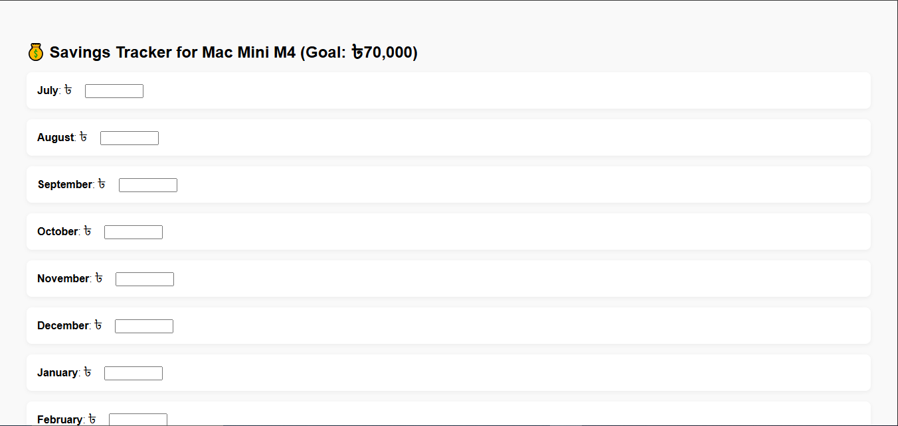

# 💰 miniFund – Your Personal Savings Tracker

**miniFund** is a lightweight, privacy-first savings tracker designed to help you stay on track with your financial goals — one month at a time.

Whether you're saving up for your first Mac, a new laptop, or any dream tool, this tiny app gives you a focused, offline experience with zero distractions and full control.



### Access it here: [miniFund](https://mdnakibul.github.io/miniFund/)

---

## 🚀 Features

- ✅ Month-by-month savings input
- ✅ Total saved vs. goal progress
- ✅ Offline storage using `localStorage`
- ✅ Fully responsive and mobile-friendly
- ✅ 100% client-side – no backend or tracking

---

## 🛠 Tech Stack

- HTML5
- CSS3
- Vanilla JavaScript (no frameworks)
- Data stored locally (no account needed)

---

## 🎯 Default Goal

This tracker is originally designed to help the creator save up **৳70,000 BDT** in 12 months to buy a **Mac Mini M4**. But you can adapt it to any goal.

You can modify the goal amount by editing this line in `index.html`:

```js
const target = 70000;
